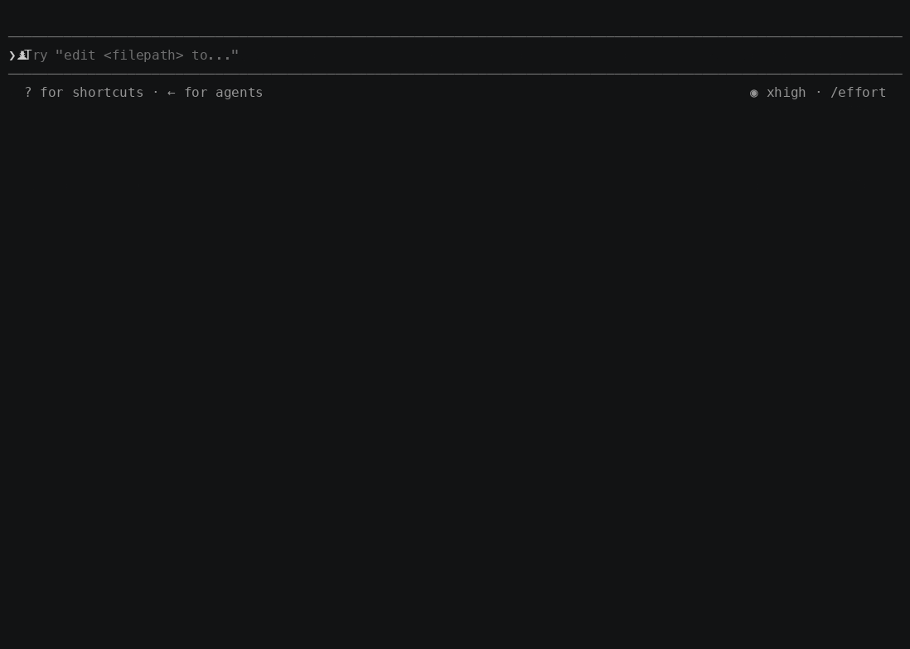

# Rookery

**Modular supply-chain attestation toolkit for Go.** Build SLSA / in-toto evidence at every step of your SDLC — local dev, CI, release, deploy — and verify it with policy.

Rookery is the upstream for **[`cilock`](cilock/)** (witness-compatible attestation CLI), the **[`attestation`](attestation/)** library, 50+ attestor plugins (see [`docs/attestor-catalog.md`](docs/attestor-catalog.md)), a pluggable signer set (see [`docs/signers.md`](docs/signers.md)), and a **[`builder`](builder/)** that emits custom binaries with only the plugins you want.



*A real, unscripted Claude Code session: `cilock` wraps a Trivy scan under eBPF kernel-side tracing and signs the result as an in-toto attestation — nothing faked.*

> Working with an AI agent on this repo? Point it at **[AGENTS.md](AGENTS.md)** — it has the layout, commands, and conventions you'd otherwise have to discover by reading source.

---

## What you actually get

| You want to… | Use |
|---|---|
| Wrap a build step and produce signed evidence | `cilock run` |
| Record attestations without wrapping a command | `cilock attest` |
| Verify a chain of attestations against policy | `cilock verify` |
| Package evidence into a portable bundle | `cilock bundle` |
| Inspect per-file inclusion proofs (inline in v0.3 product attestations) | `cilock verify` with the attestation's inline leaves |
| Manage and validate Witness policies | `cilock policy` |
| Embed attestation in your own Go program | [`attestation`](attestation/) library |
| Ship a slimmer CLI with only the attestors you need | [`builder`](builder/) |
| Drop into a GitHub Actions workflow | [`aflock-ai/cilock-action`](https://github.com/aflock-ai/cilock-action) |

Run `cilock --help` for the full command list (`attest`, `bundle`, `policy`, `plan`, `tools`, `sign`, `login`, `whoami`, …).

---

## Quick start

```bash
# Install cilock (witness-compatible CLI, all plugins)
go install github.com/aflock-ai/rookery/cilock/cmd/cilock@latest

# Wrap a build step — produces an in-toto/DSSE attestation
# (product + material are always recorded; pass --platform-url "" to sign fully offline)
cilock run \
  --step build \
  --attestations command-run,environment,git \
  --signer-file-key-path cosign.key \
  --outfile build.attestation.json \
  --platform-url "" \
  -- go build ./...

# List every attestor compiled into this binary
cilock attestors list
```

For configuring signing backends and the hosted platform, see [`docs/configuration.md`](docs/configuration.md)
and [`docs/signers.md`](docs/signers.md); for canonical attestor names and predicate types, see the
[attestor catalog](docs/attestor-catalog.md). `cilock run --help` and `cilock verify --help` document
the full set of signing, tracing, and Archivista flags.

---

## Layout

```
rookery/
├── attestation/            # Core library: AttestationContext, Attestor interface, DSSE envelope
├── cilock/                 # Batteries-included CLI (witness-compatible)
├── plugins/
│   ├── attestors/          # 50+ attestors, each its own Go module
│   └── signers/            # signer plugins — canonical list in docs/signers.md
├── presets/                # Curated plugin sets (minimal, cicd, all) — blank-import these
├── builder/                # Generate custom cilock binaries with a chosen plugin set
├── compat/                 # Import shims for the legacy witness.dev module paths
└── docs/
    └── attestor-catalog.md # Canonical attestor names + predicate types
```

**Module path convention:** `github.com/aflock-ai/rookery/...`
**Each plugin is its own `go.mod`** so you can depend on, e.g., just `plugins/attestors/git` without dragging in the whole tree.

---

## Three ways to consume

### 1. Use the prebuilt `cilock` CLI
The default binary ships every attestor and a sensible signer set. Best for getting started, CI, and dogfooding.

### 2. Build a custom CLI with `builder`
Pick only the plugins you ship — smaller binary, smaller transitive dep tree.
```bash
cd builder
go run ./cmd/builder/ --preset minimal --local --output /tmp/cilock-min
/tmp/cilock-min attestors list
```
Presets: `minimal` (commandrun + environment + git + material + product, with the file signer),
`cicd` (minimal + github, gitlab, slsa), `all` (every attestor + every signer). Run
`go run ./cmd/builder/ --help` for manifest format and the `--with`, `--fips`, and `--manifest` flags.

### 3. Embed the library
The high-level entrypoint is `workflow.RunWithExports`, which builds the attestation context, runs
the attestors, and signs the collection into a DSSE envelope. Blank-import the attestor and signer
plugins you need to register them, then pass a `cryptoutil.Signer` via `RunWithSigners`:
```go
import (
    "github.com/aflock-ai/rookery/attestation"
    "github.com/aflock-ai/rookery/attestation/workflow"
    _ "github.com/aflock-ai/rookery/plugins/attestors/git"  // register the git attestor
    _ "github.com/aflock-ai/rookery/plugins/signers/file"   // register the file signer
)

results, err := workflow.RunWithExports("build",
    workflow.RunWithAttestors([]attestation.Attestor{ /* attestors */ }),
    workflow.RunWithAttestationOpts(attestation.WithWorkingDir("./")),
    workflow.RunWithSigners(signer))
// results[0].SignedEnvelope is the signed dsse.Envelope
```
See [`cilock/cli/run.go`](cilock/cli/run.go) and the [`attestation/workflow`](attestation/workflow/)
package for the full wiring (signer-provider resolution, timestampers, Archivista export).

---

## Witness / aflock compatibility

Rookery is the in-tree continuation of **[in-toto/witness](https://github.com/in-toto/witness)** with breaking-bug fixes (see [`witnessfixes.md`](witnessfixes.md)) and the new aflock predicate namespace (`https://aflock.ai/attestations/...`). Legacy `witness.dev` predicate types are still consumed via aliases registered at startup, so a chain produced by `witness` verifies under `cilock` and vice versa.

The default `cilock` binary keeps both registrations so it works in mixed environments. If you build a custom binary via `builder`, the aliases are still registered.

---

## Plugin catalog

[`docs/attestor-catalog.md`](docs/attestor-catalog.md) lists every registered attestor — the **canonical name** in column 1 is what you pass to `--attestations` (or `cilock-action`'s `attestations:` input). It is not always the directory name (`commandrun` registers as `command-run`, `aws-iid` as `aws`, etc.). Mismatches fail fast with `attestor not found`.

Regenerate after adding or renaming an attestor:
```bash
make docs   # runs scripts/gen-attestor-catalog.sh
```

---

## Development

```bash
git clone https://github.com/aflock-ai/rookery.git
cd rookery
make build       # build every module via go.work
make test        # run all tests
make lint        # golangci-lint across the workspace
make verify-isolated  # confirm each module builds without go.work
make help        # list all targets
```

The repo uses **`go.work`** for local development. CI also runs each module in isolation (`GOWORK=off`) to catch accidental cross-module coupling.

Go version is pinned in **`.go-version`**; every `go.mod` must match. CI enforces this.

See [`CONTRIBUTING.md`](CONTRIBUTING.md) for signed-commit setup, conventional-commit format, and the "add a new plugin" checklist.

---

## Versioning

Path-prefixed tags (standard Go multi-module convention):
```
attestation/v0.1.0
plugins/attestors/git/v0.1.0
plugins/signers/file/v0.1.0
cilock/v0.1.0
```

---

## License & provenance

Apache 2.0. See [`LICENSE`](LICENSE) and [`NOTICE.md`](NOTICE.md).

Anything inlined from upstream projects is tracked in `.provenance/*.json` — each entry pins the upstream commit, license SPDX, and a SHA256 over both upstream and local copies. CI re-verifies on every PR via [`scripts/check-provenance.sh`](scripts/check-provenance.sh).

---

## Related

- **[`aflock-ai/cilock-action`](https://github.com/aflock-ai/cilock-action)** — GitHub Action wrapper
- **[`aflock-ai/supply-chain-attacks`](https://github.com/aflock-ai/supply-chain-attacks)** — catalog of real attacks + cilock detections
- **[`testifysec/judge`](https://github.com/testifysec/judge)** — attestation collection + verification platform
- **[`in-toto/witness`](https://github.com/in-toto/witness)** — upstream lineage
