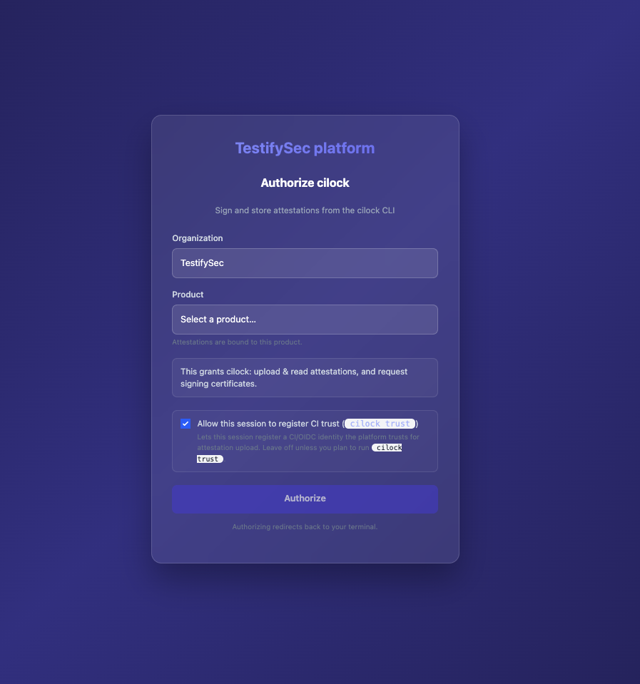
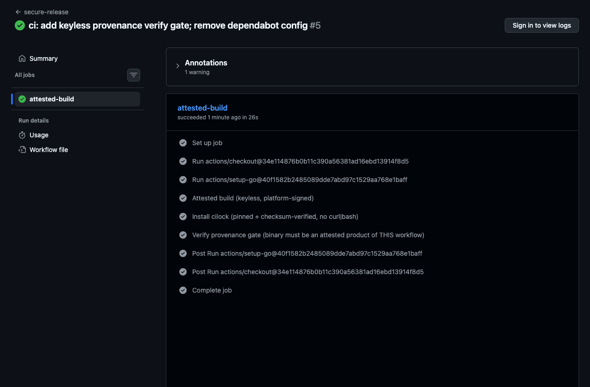

Most write-ups about supply-chain hardening are composed weeks after the fact, by someone who was not in the terminal when it happened. This one was written in the terminal, while it happened. The screenshots are timestamped from the build. If that sounds like a strong claim, good, because the entire point of attestation is that claims should be checkable. So here is the clock.

<!-- truncate -->

| Clock | Time (CDT) | What happened |
|------:|:----------:|:--------------|
| +0 | 09:16 | Downloaded CI/lock and verified its own provenance |
| +5m | 09:21 | Offline attested pipeline ran; tamper test rejected a forged binary |
| +21m | 09:37 | Authenticated to the platform (screenshots captured live) |
| +25m | 09:41 | The runbook you are reading was created, mid-build |
| +28m | 09:44 | Public repo live; offline tier complete |
| +37m | 09:53 | Keyless Level 3 build, green in CI |
| +62m | 10:18 | Fail-closed verification gate, green in CI |
| +74m | 10:30 | Illustrated runbook finished |

Everything after the 62 minute mark was writing what you are reading. The security work landed in about an hour, and the documentation accreted as a byproduct of doing it. The runbook was created at the 25 minute mark, while the gate it documents did not yet exist. Here is how the hour went, and why it went that fast.

## Act 1: The climb

We started by forking Hugo, a static site generator that real people ship real sites with, not a hello-world repo built to make a point. The first tier of hardening needs no account and no network trust at all. One script wraps every build stage in a CI/lock attestation. It pins the source commit, records the build, produces a CycloneDX software bill of materials, runs a vulnerability scan, and signs a policy that gates the binary. All of it offline, with a local key.

That earns SLSA Build Level 1, plus the cryptographic substance that Level 2 also asks for: real signatures over real provenance. It is honest to call it exactly that, and nothing more. A local key sitting on the same machine as the build is forgeable, which means it is not Level 2 and not Level 3, and we did not dress it up as either.

Reaching Level 3 takes no extra YAML. It is a change of where the build runs and who holds the key. Move the same steps onto an ephemeral GitHub Actions runner, give the job an OIDC token, and the signer becomes a short-lived Fulcio certificate bound to the workflow's own identity. The build steps never touch a private key, because there is no longer a private key for them to touch. That isolation, a builder you do not operate and a key the build cannot reach, is what Level 3 actually means. The certificate on our CI attestation states it in plain text: issued by the TestifySec Platform Fulcio CA, subject set to the exact workflow file at github.com/testifysec/hugo, runner environment recorded as github-hosted. None of that is a name a human typed. It is the pipeline vouching for itself.

*Authenticating the build to the platform, captured live at the 21 minute mark.*

## Act 2: The gate

Generating provenance is the easy 80 percent, and it is where a lot of the industry stops. An attestation nobody checks is a sticker. The question that matters is whether your pipeline will refuse to ship when the evidence is wrong, and the only way to know is to try to break it.

So we tried. We took the built binary, appended a single byte, and ran verification again. It failed, for the correct reason: the tampered digest is not a subject of any attestation signed by the trusted workflow identity. The honest binary verifies and the altered one is rejected, and the build stops there. The policy doing the enforcing is itself signed, by the offline release key, and it trusts exactly one signer for the build step: the keyless CI identity from Act 1. The operator signs the rule, the build signs the evidence, and the two are checked against each other. That separation is the whole game.

*The gate, green in CI: the honest build verifies and ships.*

## Act 3: Why it was fast

Here is the part that matters if you are the one paying for it. Standing up Level 3 with policy-gated releases is normally scoped as a multi-week project for a platform team, because the list of moving parts is long: a Fulcio certificate authority, a timestamp authority, an attestation store, a policy engine, and the glue holding them together. We ran none of it. The TestifySec platform brings that trust plane and you operate exactly none of it. Our side of the contract was one workflow permission, id-token: write, and four words of attestor configuration. The platform URL, the keyless signing, and the attestation storage all came from defaults.

That is the real reason the clock reads an hour and not a quarter. The undifferentiated work, the part every company would otherwise rebuild and rebuild badly, is already done and already running. You bring a build command and an identity.

There is a second multiplier, and leaving it out would be dishonest, because half this story is that the session was driven by an AI coding agent rather than typed by hand. The agent read the release manifest and declined to pipe the installer into a shell. It decoded the signing certificate to confirm the identity was what we expected. It walked into a genuine wall, a Go build that is not bit-for-bit reproducible across machines, worked out why the gate verifies the attested artifact instead of a local rebuild, and kept going. A human approved the browser login and owned the judgment calls about visibility and naming. The agent did the rest, and it wrote the runbook as it worked. A CLI built to be driven, and an agent able to drive it; neither half alone gets you to an hour.

## Act 4: The payoff you did not have to ask for

None of the evidence we just produced is disposable. It is signed, timestamped, and durable, and it maps to the compliance frameworks you will be asked about, on the day you decide you are ready to be asked. The most pressing of those today is the EU Cyber Resilience Act.

CRA is not a voluntary badge you chase to close a deal. It is law, with obligations phasing in toward 2027 and vulnerability-reporting duties landing earlier, and it gates access to the EU market with real penalties behind it. For products with digital elements it requires a machine-readable bill of materials covering at least your top-level dependencies, documented vulnerability handling, evidence that the product was built and shipped with integrity, and technical documentation that demonstrates all of it. Read that list again against what the build already emitted.

| CRA expectation | What this build already produced |
|:----------------|:---------------------------------|
| Machine-readable SBOM, top-level dependencies at minimum | A full transitive CycloneDX SBOM, signed as an attestation |
| Documented vulnerability handling | An attested vulnerability scan, traceable to components through the SBOM |
| Product integrity, secure by design | SLSA provenance plus a gate proving the shipped binary is the one built from attested source |
| Technical documentation for conformity | A signed, timestamped evidence trail, plus a generated SSDF and SLSA mapping |
| Due diligence on third-party and open-source components | Lockfile and material attestations that pin the dependency graph |

A careful line is owed here, because this is legal ground and overclaiming on it is its own kind of insecurity. The platform produces and maps the technical evidence that underpins these requirements. It does not file your conformity assessment, affix a CE mark, or run your disclosure process. Those are organizational obligations, and your counsel owns the exact dates and the scope. What the platform takes off your plate is the part engineers actually dread, which is assembling the evidence after the fact, by hand, under a deadline. You generated it as a side effect of a build you were going to run regardless.

The same evidence answers more than CRA. Point it at NIST's Secure Software Development Framework, at SOC 2, at FedRAMP, and it is the same signed attestations read through a different control mapping. You do the security engineering once. The audit artifacts are there when you need them and not a minute sooner, which is precisely how a security team prefers it.

## The receipt

That is the whole story. A real project, forked and hardened to a Level 3 release with a gate that fails closed, in about an hour, with the write-up coming out of the same session. The speed holds up because the trust plane was already running and the agent driving the CLI knew what it was doing. The compliance mapping, CRA included, is not a second project you signed up for later. It is the same evidence, waiting.

The screenshots above are from that session, timestamped from the build. Everything here verifies.
