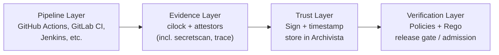

# Trust model

This page is the deliberately honest version of "what does CI/lock actually protect against?" It's worth being precise here, because supply-chain tooling is easy to overpromise.

## What CI/lock attests to

Signed evidence answers the **factual** questions:

- This command ran with this argv on this commit (via `commandrun` + `git`).
- These input files (with these digests) were present at material-collection time.
- These output files (with these digests) were produced after execute.
- This identity (functionary) signed the collection at this time.
- This SBOM / SARIF / scan was attached to this run.
- (With `--trace` on Linux) These files were opened by these processes during execute.

## What CI/lock does **not** attest to

It's just as important to be clear about what's outside scope:

- **Correctness:** CI/lock does not assert that your build is bug-free, your tests are good, or your code does what it claims.
- **Absence of vulnerabilities:** a signed SBOM proves what's inside, not that it's safe.
- **Malicious-but-signed activity:** if a fully compromised CI runner produces evidence with a valid functionary identity, CI/lock will faithfully attest to whatever happened.

CI/lock raises the floor on "what can you prove about your release?", it does not eliminate the need for SAST, runtime monitoring, code review, or any other defense-in-depth control.

## The three-layer defense

CI/lock catches supply-chain attacks at three independent layers. An attacker has to bypass *all three* to succeed.

| Layer | Mechanism | Catches |
|---|---|---|
| **1. Prevention** | Approved-source allowlist + SHA pinning enforced via Rego on `refpinned` and `actionref` | Tag rewrites (Trivy, tj-actions), unapproved third-party actions |
| **2. Content detection** | `secretscan` attestor with recursive base64/hex/URL decoding (default depth 3) + Gitleaks patterns | Encoded credential exfiltration in stdout/stderr/products (LiteLLM `.pth` payload, base64 stealer scripts) |
| **3. Behavioral detection** | `--trace` (Linux; eBPF where supported, else ptrace+seccomp) records `openedfiles` per process; OPA Rego on filesystem patterns | Covert credential harvesting that writes only to files (real TeamPCP stealer pattern) |

For a full walkthrough of how each layer stops specific real-world attacks, see [Defending against supply-chain attacks](../tutorials/defending-against-supply-chain-attacks).

## Threats addressed

| Threat | How CI/lock helps | Layer |
|---|---|---|
| Tampered logs / forged screenshots | Signed evidence resists post-hoc edits. | All |
| "Did this scan actually run?" | Required-attestor policies fail closed when scan evidence is missing. | All |
| Tag-hijack attacks (e.g. Trivy March 2026, tj-actions March 2025) | SHA-pinning enforcement; mutated tags are rejected by policy before execution. | 1 |
| Credential exfiltration via stdout (e.g. base64 stealer scripts) | `secretscan` recursive decoder unpacks encoded payloads and matches Gitleaks patterns. | 2 |
| Covert file-based credential harvesting (TeamPCP-style) | `--trace` + behavioral OPA rules catch the filesystem access fingerprint. | 3 |
| Cross-CI provenance gaps | Standardized envelopes (DSSE + in-toto) work across systems. | Cross-cutting |
| Long-term audit reconstruction | Timestamped evidence remains verifiable years later. | Cross-cutting |
| Drift between intent and reality in release process | Policy verification turns "we always do X" into a check. | Cross-cutting |

## Threats out of scope

| Threat | Why CI/lock alone doesn't address it | What does |
|---|---|---|
| A fully compromised CI runner | The runner can produce attestations for anything it wants with valid identity. | Runner hardening, ephemeral runners |
| A malicious functionary with valid identity | Verification will pass; identity-based trust assumes the functionary is honest. | Multi-party signing, mandatory review |
| Network egress to attacker C2 during a step | With `--trace`, CI/lock records `connect`/`bind`/`sendto` (destination IP, port, TLS SNI) as evidence and policy can fail the build on a bad destination — but it *observes*, it does not block in-flight traffic. | An inline egress proxy (e.g. [StepSecurity Harden-Runner](https://github.com/step-security/harden-runner)) for real-time blocking |
| Bugs in code being built | CI/lock doesn't inspect what your build does, only what it ran. | SAST, code review, fuzzing |
| Compromised dependencies *upstream* of your build | Evidence reflects what was used, not whether it was safe. | SBOM scanning, SCA, vendor due diligence |
| Attacks on developer laptops or prod servers | CI/lock operates in CI/CD only. | Endpoint protection, runtime EDR |

## Detection vs. real-time prevention

CI/lock is **forensic and policy-driven**, not a runtime IPS. The mental model:

```
[Step starts] → [Cilock observes] → [Step completes] → [Sign + store evidence]
                                                                ↓
                                                       [Policy verify @ release]
                                                                ↓
                                                        [Allow or block release]
```

If a step exfiltrates secrets during execution, the exfiltration has already happened by the time policy runs. CI/lock blocks the *release* of the affected artifact and produces a tamper-evident forensic record, but it does not stop the initial exfiltration. Layer 1 (prevention) is what reduces the chance of that step running at all.

## FIPS mode

The `cilock` binary is built with `fips140=on` (Go's FIPS 140 verified cryptography mode). For environments that require FIPS-validated cryptography, this is on by default, no separate FIPS build is needed.

## How the layers fit together



Each layer is independently swappable: change CI systems, swap evidence stores, replace your verifier, the contract between layers (DSSE + in-toto envelopes) stays stable.
