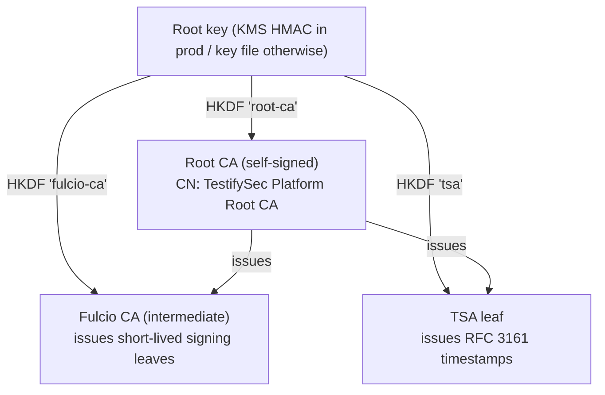
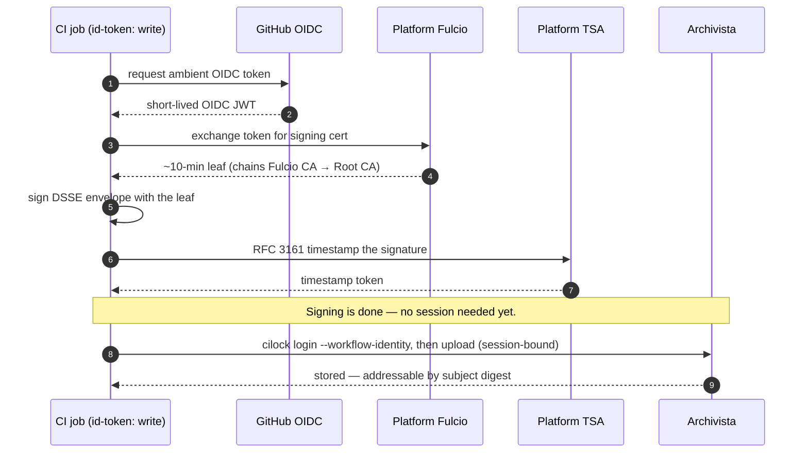
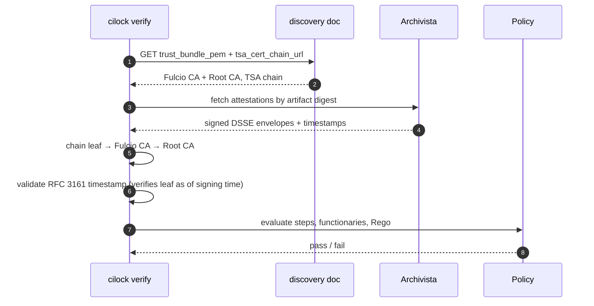

# Platform PKI & trust

This page explains the public-key infrastructure behind the TestifySec platform —
the certificate authorities `cilock` signs and verifies against, how your client
discovers them, and the one mistake that breaks supply-chain verification in a way
the error messages don't make obvious: **trusting the wrong platform's roots when
the Common Names happen to match.**

If you only need to *connect and run*, start with
[Connect to the platform](../getting-started/connect-to-the-platform). This page is
the reference for *why* that works and *what* you are trusting. For the conceptual
threat model (what CI/lock does and does not protect against), see
[Trust model](../concepts/trust-model); for signer identities, see
[Signing & identity](../concepts/signing-and-identity).

## One root, two CAs

A TestifySec platform derives its entire PKI from a **single root key**. The root
key HKDF-derives (RFC 5869) three things, in memory, at startup:

- a self-signed **Root CA** (the trust anchor),
- a **Fulcio CA** (intermediate) that mints the short-lived **signing** leaves, and
- a **TSA** leaf that signs RFC 3161 **timestamps**.



Because derivation is deterministic, every replica of the platform derives the
**same** CA public keys — so a signature minted on one replica verifies on any
other. The hosted platform runs three replicas behind one URL; you never see this,
but it's why keyless signing is reliable under load.

The practical consequence for you: **you never hard-code roots.** Your `cilock`
client learns them from the platform.

## Discovery: where trust comes from

Every platform publishes one unauthenticated document:

```bash
curl -fsSL "$PLATFORM_URL/.well-known/judge-configuration" | jq .
```

```jsonc
{
  "archivista_url":   "https://platform.testifysec.com/archivista",
  "fulcio_grpc_addr": "[::]:5554",
  "graphql_url":      "https://platform.testifysec.com/query",
  "tsa_url":          "https://platform.testifysec.com/api/v1/timestamp",
  "signing": {
    "assurance_level":    "aal1",
    "fulcio_oidc_issuer": "https://platform.testifysec.com/fulcio/oidc",
    "fulcio_url":         "https://platform.testifysec.com",
    "oidc_audience":      "sigstore",
    "trust_bundle_pem":   "-----BEGIN CERTIFICATE-----…",   // Fulcio CA + Root CA
    "trust_bundle_url":   "https://platform.testifysec.com/api/v1/fulcio/trustbundle",
    "tsa_cert_chain_url": "https://platform.testifysec.com/api/v1/timestamp/certchain"
  }
}
```

The field that matters most is **`signing.trust_bundle_pem`** — it inlines the
Fulcio CA *and* the Root CA, so one fetch tells your client both *where to sign* and
*what to trust*. `tsa_cert_chain_url` serves the TSA leaf + Root CA, used to validate
timestamps (and to validate a keyless signature after its short-lived leaf expires).

`$PLATFORM_URL` is `https://platform.testifysec.com` for the hosted platform, or your
own host for a self-hosted / `--standalone` instance.

## Signing needs no login; uploading does

This is the single most useful distinction to internalize:

| What you're doing | What it proves | Login? |
|---|---|---|
| **Sign** (Fulcio + TSA) | this identity made this evidence at this time | **No** — keyless |
| **Upload** (Archivista) | this evidence belongs to this tenant/product | **Yes** — a session |

**Signing is keyless.** In CI, with `id-token: write`, the runner mints an ambient
OIDC token; the platform Fulcio exchanges it for a leaf that lives ~10 minutes —
long enough to sign, too short to be worth stealing. The TSA timestamps the
signature so it stays verifiable long after the leaf expires.

**Uploading binds evidence to your tenant**, so it needs a session.
`cilock login` (or `cilock login --workflow-identity` in CI) sets that up.



## Verifying

Once logged in, `cilock verify` needs **no trust flags** — it pulls the Fulcio roots
and the policy-signer identity from the discovery document:

```bash
cilock verify ./myapp -p policy.json --platform-url "$PLATFORM_URL" --enable-archivista
```

Offline (no session, air-gapped), you supply trust yourself:

```bash
cilock verify ./myapp -p policy.json \
  --policy-ca-roots roots.pem \
  -a attestation-1.json -a attestation-2.json
```

Under the hood, verify chains each signing leaf to the Fulcio CA and then to the
Root CA, and validates the RFC 3161 timestamp against the TSA chain — which is what
lets a years-old signature still verify after its leaf has long expired.



## :warning: Same CN, different key = wrong platform

This is the failure that looks like a bug in `cilock` but is actually a trust
**misconfiguration**, and it is easy to hit because every TestifySec platform
derives its certificates from the same code — so they all share the **same Common
Names**:

- Root CA CN: `TestifySec Platform Root CA`
- Fulcio CA CN: `TestifySec Platform Fulcio CA`
- TSA CN: `TestifySec Platform TSA`

Production and staging are **different platforms with identical CNs but different
keys.** A Common Name tells you a certificate's *role*; it tells you **nothing**
about *which platform* issued it. Only the **key** does.

**Symptom.** Verification fails with `verifiers=0` on every collection, and any
timestamp check fails with `x509: ECDSA verification failure` — against a Root CA
whose name matches what you expected.

**Cause.** Something on the verify side trusts platform A while the evidence was
signed by platform B. The classic case: a release policy that embeds **staging**
roots while the binaries were **production**-signed. A prod leaf cannot chain to a
staging Root CA, no matter how identical the names are.

**How to confirm it.** Compare the Root CA *key* fingerprint from each side. They
must match.

```bash
# Root CA public-key fingerprint (SPKI) from a platform's discovery
curl -fsSL "$PLATFORM_URL/.well-known/judge-configuration" \
  | jq -r '.signing.trust_bundle_pem' \
  | awk 'BEGIN{n=0} /BEGIN CERT/{n++} {if(n==2) print}' \
  | openssl x509 -noout -pubkey \
  | openssl pkey -pubin -outform DER \
  | openssl dgst -sha256 | cut -c1-8
```

If the fingerprint from the platform you signed against differs from the Root CA
embedded in your policy (or passed via `--policy-ca-roots`), you are trusting the
wrong platform. Re-fetch trust from the **same** `$PLATFORM_URL` you signed against,
and re-sign any signed policy against that platform.

> **Rule of thumb:** when two roots have the same CN, compare their **keys** (SPKI),
> never their names. Same name + different key = different platform = verification
> fails closed.

## See also

- [Connect to the platform](../getting-started/connect-to-the-platform) — `cilock login`, `cilock use`, `cilock doctor`, `cilock trust`.
- [Trust model](../concepts/trust-model) — what CI/lock protects against (and what it doesn't).
- [Signing & identity](../concepts/signing-and-identity) — signer providers and how functionaries are matched.
- [Timestamping](../concepts/timestamping) — verifying expired-certificate signatures.
- [Policy schema](./policy-schema) — `roots`, `timestampauthorities`, functionaries, Rego.
- [CLI reference](./cli) — `cilock login`, `cilock verify`, `cilock sign` flags.
