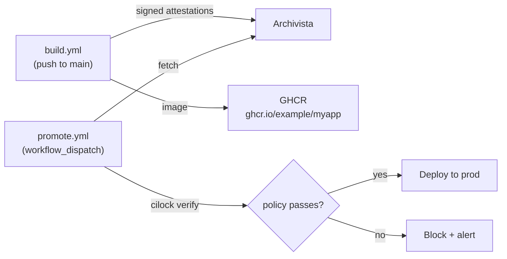

# A release promotion gate driven by CI/lock evidence

This tutorial wires a real release-promotion gate: a build pipeline produces signed attestations, and a separate promotion workflow refuses to deploy until `cilock verify` proves the build met policy. It's the operational answer to *"how do we make sure no one ships a release that skipped the SBOM step?"*

For the broader operational guide on gate design (soft-fail vs. fail-closed, where to put the gate, recording the verification result), see [Verify in a release gate](../guides/verify-in-a-release-gate).

## What you'll build



Two workflows, one shared evidence store, one signed policy.

## Step 1: The signed policy

Write `policy.json` declaring what every promoted release must satisfy. This example requires the `build` step to have a signed SBOM, signed by your team's GitHub Actions OIDC identity, with the build coming from `main`:

```json
{
  "expires": "2030-12-31T23:59:59Z",
  "steps": {
    "build": {
      "name": "build",
      "attestations": [
        { "type": "https://aflock.ai/attestations/material/v0.3" },
        { "type": "https://aflock.ai/attestations/command-run/v0.1" },
        { "type": "https://aflock.ai/attestations/product/v0.3" },
        { "type": "https://cyclonedx.org/bom" },
        {
          "type": "https://aflock.ai/attestations/github/v0.1",
          "regopolicies": [
            {
              "name": "must come from main",
              "module": "<base64-encoded module below>"
            }
          ]
        }
      ],
      "functionaries": [
        {
          "type": "root",
          "certConstraint": {
            "commonname": "*",
            "dnsnames": ["*"],
            "emails": ["*"],
            "organizations": ["*"],
            "uris": ["https://github.com/example/myapp/.github/workflows/build.yml@refs/heads/main"],
            "roots": ["sigstore-fulcio"]
          }
        }
      ]
    }
  },
  "roots": {
    "sigstore-fulcio": {
      "certificate": "<base64 PEM of the Fulcio root>"
    }
  }
}
```

The Rego module enforces "must come from main". The `github-action` attestor records the workflow run's `ref` indirectly via the OIDC token claims captured by the sibling `github` attestor — the runnable shape against a CI/lock attestation's predicate looks for the verified JWT claim:

```rego
package github.ref
import rego.v1

# Cilock's github attestor exposes the verified Actions OIDC token's
# claims under `input.jwt.claims`. The `ref` claim is the workflow's
# git ref (e.g. "refs/heads/main").
deny contains msg if {
    not endswith(input.jwt.claims.ref, "/main")
    msg := sprintf("build did not come from main: %s", [input.jwt.claims.ref])
}
```

Bind this Rego module to the `github` attestor's predicate type (`https://aflock.ai/attestations/github/v0.1`) in the policy's `steps[].attestations[].regopolicies` block (as shown in the JSON above) so it evaluates against the right attestation in the collection.

Sign the policy once with `cilock sign` so the verifier can validate the policy itself hasn't been tampered with:

```bash
cilock sign \
  --signer-file-key-path policy-signing.key \
  -f policy.json \
  -o policy-signed.json
```

Commit `policy-signed.json` and `policy-pubkey.pem` to the repo (or a release-engineering repo). The private signing key stays in offline storage, it's only used when the policy itself changes.

## Step 2: The build workflow (produces evidence)

`.github/workflows/build.yml`:

```yaml
name: build

on:
  push:
    branches: [main]

permissions:
  id-token: write
  contents: read
  packages: write

jobs:
  build:
    runs-on: ubuntu-latest
    steps:
      - uses: actions/checkout@v4

      - name: Set up Go
        uses: actions/setup-go@v5
        with:
          go-version: "1.24"

      - name: Install syft
        run: curl -sSfL https://raw.githubusercontent.com/anchore/syft/main/install.sh | sh -s -- -b /usr/local/bin

      - name: build
        uses: aflock-ai/cilock-action@v1.0.4
        env:
          CGO_ENABLED: "0"
        with:
          step: build
          command: go build -o bin/myapp ./cmd/myapp
          attestations: environment git github
          cilock-args: --attestor-product-include-glob "bin/*"

      - name: sbom
        uses: aflock-ai/cilock-action@v1.0.4
        with:
          step: sbom
          command: syft bin/myapp -o cyclonedx-json=bin/bom.cdx.json
          attestations: environment git github sbom
          cilock-args: --attestor-product-include-glob "bin/*"

      - name: Build and push image
        uses: docker/build-push-action@v5
        with:
          context: .
          push: true
          tags: ghcr.io/${{ github.repository }}:${{ github.sha }}
```

Each merge to `main` produces a signed SBOM + build attestation, uploaded to Archivista by default.

## Step 3: The promote workflow (gates on policy)

`.github/workflows/promote.yml`:

```yaml
name: promote to prod

on:
  workflow_dispatch:
    inputs:
      sha:
        description: "Commit SHA of the build to promote"
        required: true
      mode:
        description: "Verification mode"
        type: choice
        options: [soft-fail, fail-closed]
        default: soft-fail

permissions:
  id-token: write
  contents: read

jobs:
  verify:
    runs-on: ubuntu-latest
    outputs:
      passed: ${{ steps.gate.outputs.passed }}
    steps:
      - uses: actions/checkout@v4

      - name: Install cilock
        run: |
          VERSION=v1.1.0
          curl -sSfL "https://github.com/aflock-ai/rookery/releases/download/${VERSION}/cilock-${VERSION#v}-linux-amd64.tar.gz" \
            -o cilock.tar.gz
          tar xzf cilock.tar.gz
          sudo install -m 0755 cilock /usr/local/bin/cilock

      - name: Fetch attestations from Archivista
        env:
          ARCHIVISTA_URL: https://archivista.example.com
        run: |
          # Archivista exposes a GraphQL endpoint (/v1/query) for searching
          # by subject digest, and /v1/download/<gitoid> to fetch a specific
          # DSSE envelope. The shape below queries by the source commit SHA
          # recorded by the `git` attestor as a subject. Replace with your
          # client of choice (archivistactl, the Aflock platform client, etc).
          curl -sS -H 'Content-Type: application/json' \
            --data @<(jq -n --arg sha "${{ inputs.sha }}" '{
              query: "query($sha: String!) { dsses(where: {hasStatementWith: {hasSubjectsWith: {hasSubjectDigestsWith: {value: $sha}}}}) { edges { node { gitoidSha256 } } } }",
              variables: { sha: $sha }
            }') \
            "$ARCHIVISTA_URL/v1/query" \
            | jq -r '.data.dsses.edges[0].node.gitoidSha256' \
            | xargs -I{} curl -sSfL "$ARCHIVISTA_URL/v1/download/{}" -o build.attestation.json

      - name: Run cilock verify
        id: gate
        continue-on-error: ${{ inputs.mode == 'soft-fail' }}
        run: |
          if cilock verify \
              --policy ./policy-signed.json \
              --publickey ./policy-pubkey.pem \
              --attestations build.attestation.json \
              --subjects "sha1:${{ inputs.sha }}" ; then
            echo "passed=true" >> "$GITHUB_OUTPUT"
            echo "✅ policy passed"
          else
            echo "passed=false" >> "$GITHUB_OUTPUT"
            echo "❌ policy failed"
            exit 1
          fi

  deploy:
    needs: verify
    if: needs.verify.outputs.passed == 'true'
    runs-on: ubuntu-latest
    environment: prod
    steps:
      - run: |
          echo "Deploying ${{ inputs.sha }} to prod..."
          # ...your existing deploy steps...
```

Two important shapes:

1. **Verify is its own job.** The deploy job has `needs: verify` and `if: needs.verify.outputs.passed == 'true'`. If verify fails, deploy doesn't run.
2. **Soft-fail is selectable per run.** `continue-on-error: ${{ inputs.mode == 'soft-fail' }}` lets the verify job keep running even when `cilock verify` returns non-zero, but the `passed` output flips to `false` and the deploy job is skipped.

## The soft-fail to fail-closed rollout

Don't enable fail-closed on day one. The recommended rollout:

| Week | Mode | What you learn |
|---|---|---|
| 1–2 | `soft-fail`, deploy unconditionally | Which builds *would have* been blocked. Audit the failures, are they real policy violations or is the policy too strict? |
| 3 | `soft-fail`, deploy gated | Now the gate actually blocks, but operators can override by re-running with stricter inputs. |
| 4+ | `fail-closed` only | Policy violations stop deploys with no override. |

CI/lock makes the early-week iteration cheap because the same evidence and policy are used in both modes, only the workflow's `continue-on-error` and `if:` change.

## What gets verified

`cilock verify` runs the [five-step verification process](../concepts/policy-verification#the-verification-process):

1. Each collection's signature is valid against the policy's `publickeys` / `roots`.
2. The signer matches a trusted functionary for the `build` step.
3. The timestamp (if any) was issued by a trusted TSA at a time the cert was valid.
4. Materials/products are consistent across steps in `artifactsFrom`.
5. Every embedded Rego policy passes, including the "must come from main" rule above.

If any of these fail, the build doesn't promote.

## Going further

- **Multiple steps in the policy.** The example above only requires `build`. Real policies usually require `build` + `sast` + `test` + `package`. Each step has its own functionaries and Rego rules.
- **Recording the verification itself.** Wrap the `cilock verify` step in another `cilock run --step verify-promote` so the verification *itself* becomes a signed attestation. Useful for audit chains.
- **Admission controllers instead of CI gates.** The same policy can be evaluated by a Kubernetes admission controller (e.g. Sigstore policy-controller adapted to in-toto). The verify job above is the CI-side equivalent.

For the operational guide that goes deeper on these decisions, see [Verify in a release gate](../guides/verify-in-a-release-gate).
