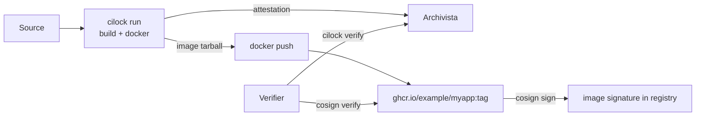

# Sign and verify a container image

CI/lock and [cosign](https://github.com/sigstore/cosign) are complementary tools for container provenance:

- **Cosign** signs the image itself, proves "this image manifest was signed by this identity."
- **CI/lock** signs evidence about *what built the image*, proves "this image came from this commit, this build command, with these inputs and this SBOM."

This tutorial wires both together so a verifier can answer both *"is this image authentic?"* (cosign) and *"is this image trustworthy?"* (CI/lock).

## What you'll build



Two signing tools, two pieces of evidence, both verifiable independently.

## Step 1: Build with attestation evidence

The build step uses cilock-action with the `docker` and `oci` attestors so the resulting attestation includes both the buildx metadata and the OCI image layer digests:

```yaml
- name: docker-build
  uses: aflock-ai/cilock-action@v1.0.1
  with:
    step: docker-build
    command: docker buildx build --metadata-file docker-metadata.json -t ghcr.io/${{ github.repository }}:${{ github.sha }} -o type=docker,dest=image.tar .
    attestations: environment git github docker oci
    cilock-args: --attestor-product-include-glob "{docker-metadata.json,image.tar}"

- name: docker-sbom
  uses: aflock-ai/cilock-action@v1.0.1
  with:
    step: docker-sbom
    command: syft image.tar -o cyclonedx-json=image-bom.cdx.json
    attestations: environment git github sbom
    cilock-args: --attestor-product-include-glob "image-bom.cdx.json"
```

Each step gets its own signed attestation: `docker-build` carries the buildx metadata + the OCI image content (via the `docker` and `oci` attestors); `docker-sbom` carries the SBOM with the image tarball as material — so a release-gate policy can verify the SBOM was generated against the image that buildx actually produced.

The buildx output is `type=docker` (a `docker save`-format tarball with `manifest.json` at the root), not `type=oci` (an OCI image-layout tarball with `index.json`); CI/lock's OCI attestor parses the former.

Why each attestor:

- **`docker`** parses the buildx metadata file (image digest, build duration, image config)
- **`oci`** unpacks the saved image tarball and digests every layer + manifest
- **`sbom`** parses the CycloneDX SBOM that syft generated against the image

The `--attestor-product-include-glob` filter ensures CI/lock captures all three artifact files in the `product` attestation.

## Step 2: Push the image and cosign-sign it

After the cilock-attested build, push the image and have cosign sign the manifest itself:

```yaml
- name: Login to GHCR
  uses: docker/login-action@v3
  with:
    registry: ghcr.io
    username: ${{ github.actor }}
    password: ${{ secrets.GITHUB_TOKEN }}

- name: Push image
  run: |
    docker buildx build \
      -t ghcr.io/${{ github.repository }}:${{ github.sha }} \
      --push .

- name: Install cosign
  uses: sigstore/cosign-installer@v3

- name: cosign sign image (keyless)
  run: |
    cosign sign --yes \
      ghcr.io/${{ github.repository }}:${{ github.sha }}
```

This is the same cosign keyless-signing pattern the rookery release pipeline uses for its own container image (verifiable from `rookery/.github/workflows/release.yml`).

The result: one image in GHCR with two parallel pieces of evidence, a cosign signature on the manifest and a CI/lock attestation in Archivista about how the image was built.

## Step 3: Verify both at promotion time

A verifier (release gate, admission controller, or any downstream system) checks both:

```bash
# Authenticity: who signed the image manifest?
cosign verify \
  --certificate-identity-regexp 'https://github.com/example/myapp/.+' \
  --certificate-oidc-issuer 'https://token.actions.githubusercontent.com' \
  ghcr.io/example/myapp:abc123

# Trustworthiness: what built the image, with what evidence?
cilock verify \
  --policy ./policy-signed.json \
  --publickey ./policy-pubkey.pem \
  --attestations "$(archivista_fetch_for_image ghcr.io/example/myapp@sha256:... | paste -sd,)" \
  --subjects sha256:...
```

If either fails, the image doesn't promote. The two checks defend against different attacks:

| Failure mode | Caught by |
|---|---|
| Image manifest replaced in the registry | `cosign verify`, manifest digest changed |
| Image was built but missing required SBOM | `cilock verify`, `sbom` attestation missing from collection |
| Image was built from the wrong branch | `cilock verify`, Rego rule on the `github` attestation rejects |
| Image was built but with unsigned/unpinned actions | `cilock verify`, Layer 1 prevention policy on `actionref`/`refpinned` |

Either by itself is a meaningful improvement; together they cover both authenticity and trustworthiness.

## Subject digest correlation

The trick that makes this work: both cosign and CI/lock end up with digests that identify the same image, just via different paths. Cosign signs the **registry OCI manifest digest** (what `docker buildx imagetools inspect` returns). CI/lock's `oci` attestor reads the tarball and records three subjects: the digest of the in-tar `manifest.json` (Docker-save format), the full `tar` digest, and the image-config digest (which is also `docker images`' "IMAGE ID"). To cross-reference, line up `imageid` from the CI/lock side with the image-config digest reachable from the registry-stored manifest:

```rego
package image.subject_match
import rego.v1

deny contains msg if {
    not input.image_digest == input.cosign_subject
    msg := sprintf(
        "image digest mismatch: cilock has %s, cosign signed %s",
        [input.image_digest, input.cosign_subject]
    )
}
```

(Wire this rule into the `oci` attestation's `regopolicies` block.)

## Patterns to consider

| Pattern | Use case |
|---|---|
| **Sign with cosign, attest with CI/lock** | The most common. Image authenticity for any consumer; build provenance for your own gate. |
| **Cosign attest with in-toto predicate** | Cosign supports attaching attestations directly to images via `cosign attest`. You can use this *instead of* Archivista for storing CI/lock attestations as OCI referrers. |
| **Both** | Push the CI/lock attestation as an OCI referrer (via `cosign attest --predicate=cilock-attestation.json --type=https://aflock.ai/attestations/...`) **and** push to Archivista. Image consumers see the attestation directly; your gate uses Archivista for cross-build queries. |

## Honest caveats

- **Image SBOMs vs source SBOMs are different.** The SBOM generated from `image.tar` enumerates everything in the image (OS packages, included libraries). The SBOM from `bin/myapp` only enumerates the app's compile-time dependencies. Pick which question you're answering and document it.
- **Cosign and CI/lock have different identity models.** Cosign verifies a single signature against an identity claim. CI/lock verifies attestation collections against a policy with multiple functionaries per step. Both are valid; they answer different questions.
- **Verifying in production** typically means baking the policy public key (and the Fulcio/Sigstore trust roots) into the verifier, at admission-controller startup, at gate-job startup, etc. Plan key distribution.

## See also

- [Release promotion gate](./release-promotion-gate), wraps this in a build → verify → promote workflow
- [SBOM and SARIF evidence](./sbom-and-sarif-evidence), patterns for the SBOM step here
- [Cosign documentation](https://docs.sigstore.dev/cosign/overview/), for the cosign side of the workflow
